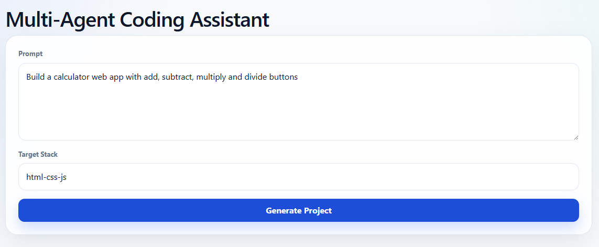
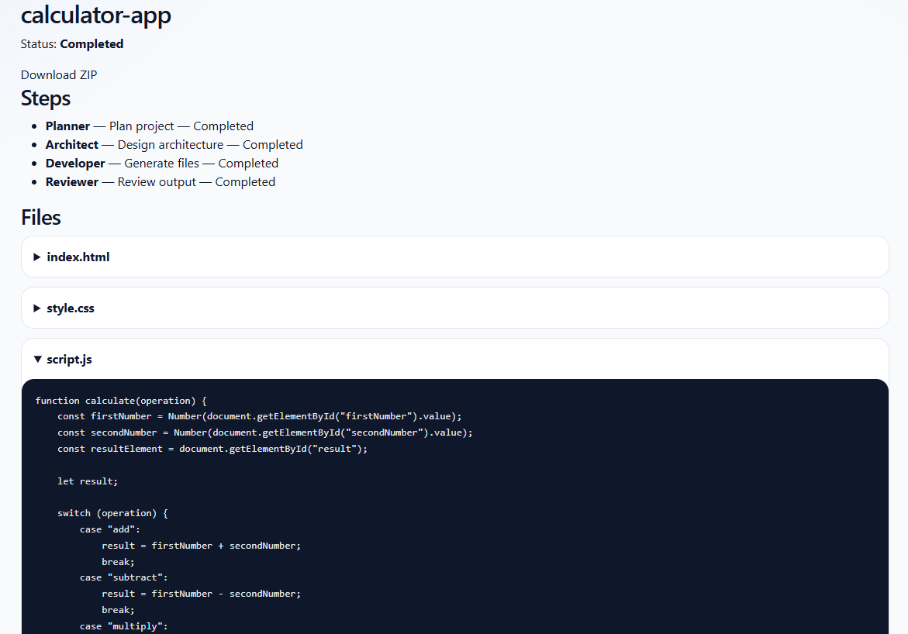

# Multi-Agent Coding Assistant

## Description

Multi-Agent Coding Assistant est une plateforme IA de génération automatique de projets logiciels.

Le système fonctionne comme une petite équipe de développement composée de plusieurs agents IA capables de :

- comprendre une demande utilisateur en langage naturel
- planifier l’architecture du projet
- générer automatiquement les fichiers source
- organiser la structure du projet
- relire et valider le code généré
- produire une application fonctionnelle exportable

---

# Exemple

Prompt utilisateur :

Build a calculator web app with add, subtract, multiply and divide buttons

Le système génère automatiquement :

calculator-app/
├── index.html
├── style.css
└── script.js

avec une application fonctionnelle exportable en ZIP.

Fonctionnalités actuelles
Backend
.NET 9 Web API
EF Core + PostgreSQL
Architecture Clean Architecture
Repository + UnitOfWork
Orchestrateur multi-agent MVP
Génération automatique de fichiers
Export ZIP des projets générés
Frontend
Blazor Web App
UI moderne responsive
Création de génération IA
Visualisation des fichiers générés
Téléchargement du projet ZIP
Architecture
MultiAgentCodingAssistant/
├── src/
│   ├── CodingAssistant.Api
│   ├── CodingAssistant.Domain
│   ├── CodingAssistant.Application
│   ├── CodingAssistant.Infrastructure
│   ├── CodingAssistant.Contracts
│   └── CodingAssistant.Web
│
├── tests/
│   └── CodingAssistant.Tests
Multi-Agent Workflow

Le système simule plusieurs agents IA :

Agent	Responsabilité
Planner Agent	Analyse le prompt utilisateur
Architect Agent	Définit la structure du projet
Developer Agent	Génère les fichiers source
Reviewer Agent	Vérifie et valide le résultat
Stack Technique
Backend
.NET 9
ASP.NET Core Web API
Entity Framework Core
PostgreSQL
Swagger/OpenAPI
Frontend
Blazor
CSS moderne responsive
IA (roadmap)
OpenAI API
Ollama
LangGraph
Semantic Kernel
Screenshots
Home

Generation UI

Generated Files

Roadmap
Phase 1 — MVP
 Clean Architecture
 EF Core + PostgreSQL
 API génération
 Multi-agent orchestration MVP
 Génération HTML/CSS/JS
 Export ZIP
 UI Blazor
Phase 2
 SignalR realtime logs
 Génération async/background jobs
 Templates multiples
 React/Vue/.NET templates
 Docker generation
Phase 3
 OpenAI integration
 Ollama local LLM
 AI code review
 AI architecture planning
 GitHub export
Phase 4
 Full autonomous coding agents
 Multi-file reasoning
 Test generation
 CI/CD generation
 AI DevOps workflows
Vision

Construire une plateforme IA capable de transformer une idée exprimée en langage naturel en projet logiciel fonctionnel automatiquement.

Auteur

Rachid Bariz