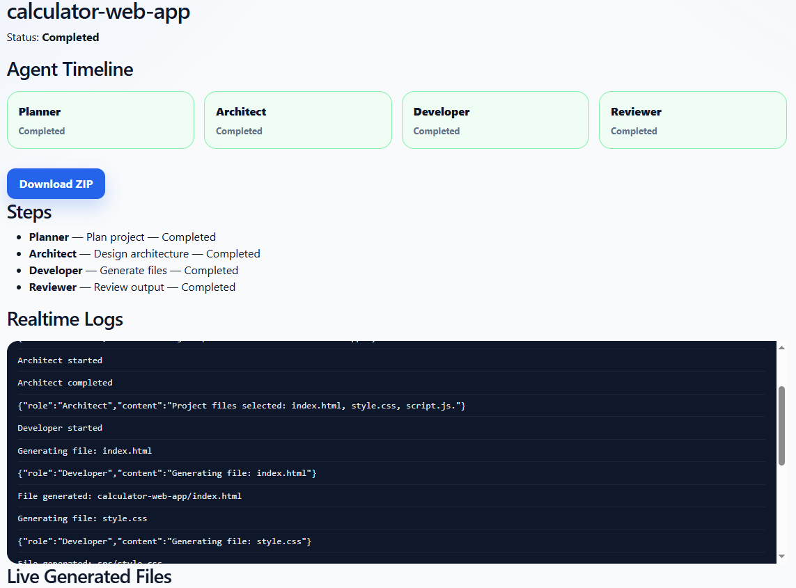
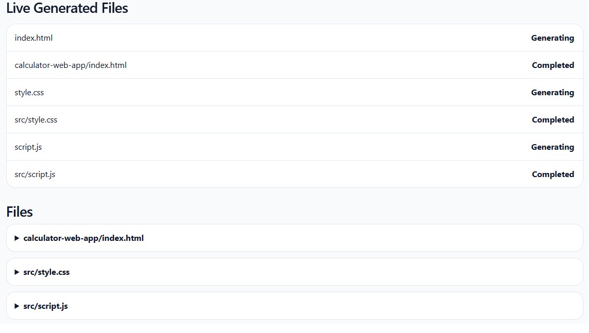
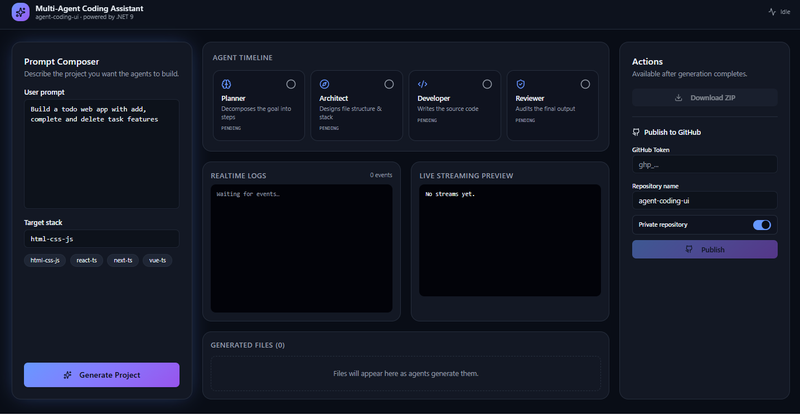

# Multi-Agent Coding Assistant

## Description

Multi-Agent Coding Assistant est une plateforme IA de génération automatique de projets logiciels construite avec .NET 9, React,Blazor, SignalR, EF Core, PostgreSQL et Ollama.

Le système reproduit le fonctionnement d’une petite équipe virtuelle de développement composée de plusieurs agents IA collaboratifs capables de transformer une simple demande utilisateur en projet logiciel fonctionnel.

Le système fonctionne comme une petite équipe virtuelle composée de plusieurs agents IA capables de :

- comprendre une demande utilisateur en langage naturel
- planifier l’architecture d’un projet
- générer automatiquement les fichiers source
- organiser la structure du projet
- produire des logs temps réel
- relire et valider le code généré
- exporter un projet fonctionnel en ZIP
- Streaming temps réel du code généré
- Explorateur de fichiers interactif
- Monaco Editor (VS Code-like)
- Publication GitHub automatisée
- Dashboard React/TanStack moderne

---

# Exemple

Prompt utilisateur :

Build a calculator web app with add, subtract, multiply and divide buttons

Le système génère automatiquement :

calculator-app/
├── index.html
├── style.css
└── script.js

avec une application fonctionnelle exportable en ZIP.

Fonctionnalités actuelles

Backend
.NET 9 Web API
Clean Architecture
EF Core + PostgreSQL
Repository + UnitOfWork
Orchestrateur multi-agent
Workflow asynchrone
Génération IA via Ollama
Export ZIP des projets générés
SignalR realtime notifications
Frontend
Blazor Web App
UI moderne responsive
Génération IA interactive
Logs temps réel
Visualisation des fichiers générés
Téléchargement ZIP
Workflow temps réel SignalR

## Architecture

MultiAgentCodingAssistant/
├── src/
│   ├── CodingAssistant.Api
│   ├── CodingAssistant.Domain
│   ├── CodingAssistant.Application
│   ├── CodingAssistant.Infrastructure
│   ├── CodingAssistant.Contracts
│   └── CodingAssistant.Web
│── agent-coding-ui
│
├── docs/
│   ├── screenshots/
│   └── architecture/
├── tests/
│   └── CodingAssistant.Tests

## Workflow Multi-Agent

Le système simule plusieurs agents IA collaboratifs :

Agent	Responsabilité
Planner Agent	Analyse la demande utilisateur
Architect Agent	Définit l’architecture du projet
Developer Agent	Génère les fichiers source
Reviewer Agent	Vérifie et valide le résultat
System Agent	Gère orchestration et monitoring
Workflow Temps Réel
User Prompt
    ↓
Planner Agent
    ↓
Architect Agent
    ↓
Developer Agent
    ↓
Reviewer Agent
    ↓
ZIP Export
	↓
Realtime Streaming
    ↓
GitHub Export

Les événements sont diffusés en temps réel via SignalR :

GenerationStarted
AgentMessage
FileGenerated
GenerationCompleted
GenerationFailed

## Dashboard IA Temps Réel

Le dashboard moderne React/TanStack permet :

- suivi temps réel des agents IA
- visualisation des étapes d’orchestration
- streaming live du code généré
- visualisation des fichiers générés
- édition/lecture via Monaco Editor
- export ZIP
- publication GitHub
- monitoring temps réel via SignalR

Le comportement se rapproche d’outils modernes comme :
- Cursor
- Devin
- GitHub Copilot Workspace
- AI Studio

## Stack Technique

### Backend
	.NET 9
	ASP.NET Core Web API
	Entity Framework Core
	PostgreSQL
	SignalR
	Swagger/OpenAPI
	
### Fontend
	- React + TanStack Router
	- Blazor Web App
	- Tailwind CSS
	- Monaco Editor
	- SignalR Client
	- Dashboard temps réel type AI Ops Center
	- UI SaaS moderne responsive
	
### AI
	Ollama
	qwen2.5-coder
	OpenAI-ready architecture
	LangGraph-ready architecture
	Semantic Kernel ready

## Screenshots

Home

Generation UI

Generation UI

Generated Files

ZIP Export

TimeLine Screen 1

TimeLine Screen 2

react Coding Agent UI

## Roadmap

## EN COURS

- Multi-template generation
- React / Next.js / Blazor templates
- AI architecture planner
- AI code reviewer
- AI-generated tests
- Persistent execution history
- Workspace generation
- Dockerfile intelligent generation

## À VENIR

- Multi-model routing
- OpenAI support
- Patch existing project mode
- AI debugging agent
- AI DevOps workflows
- Multi-file reasoning
- Autonomous coding workflows
- CI/CD generation
- Full agent collaboration system

## Vision

Construire une plateforme IA capable de transformer une idée exprimée en langage naturel en projet logiciel fonctionnel grâce à des workflows multi-agents temps réel, du streaming de code, de l’orchestration IA et des agents autonomes collaboratifs.

L’objectif est d’explorer l’évolution des assistants IA vers de véritables équipes virtuelles de développement logiciel.

## Autheur
Rachid Bariz