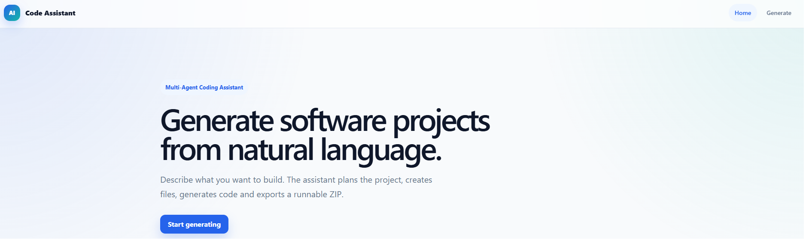
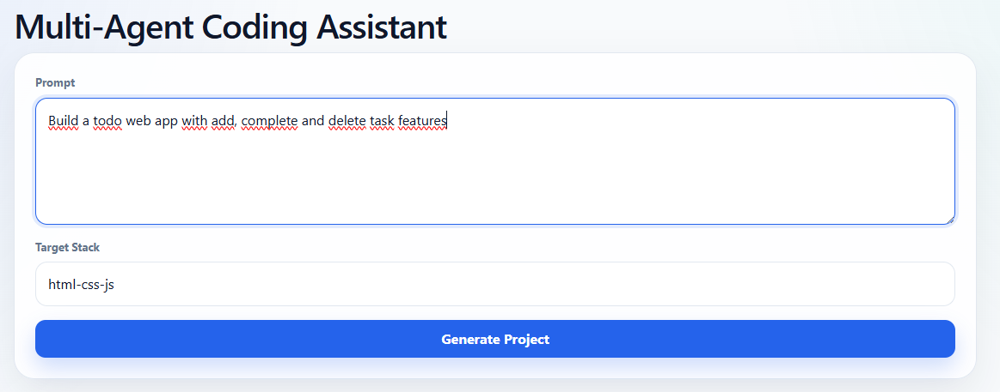
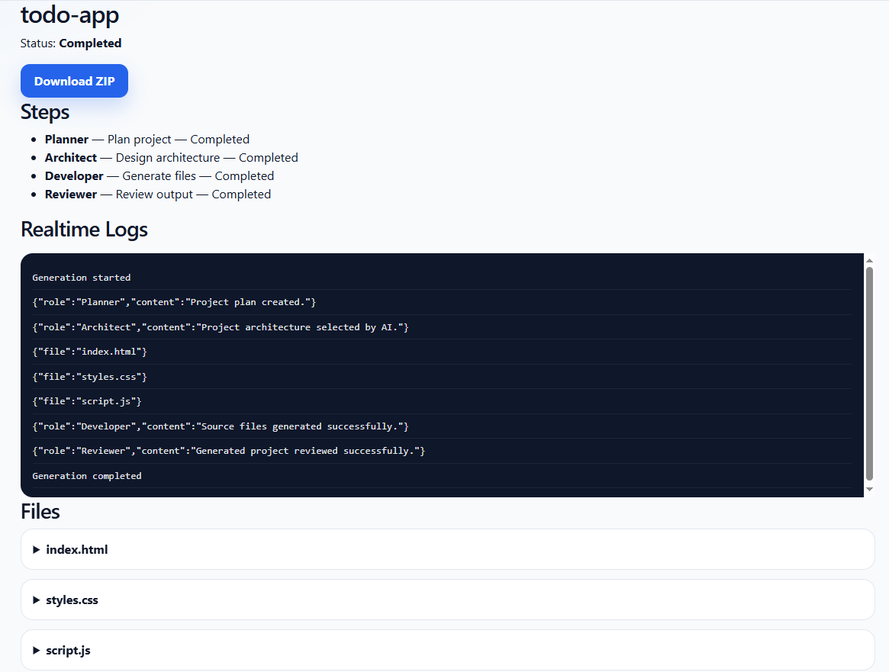
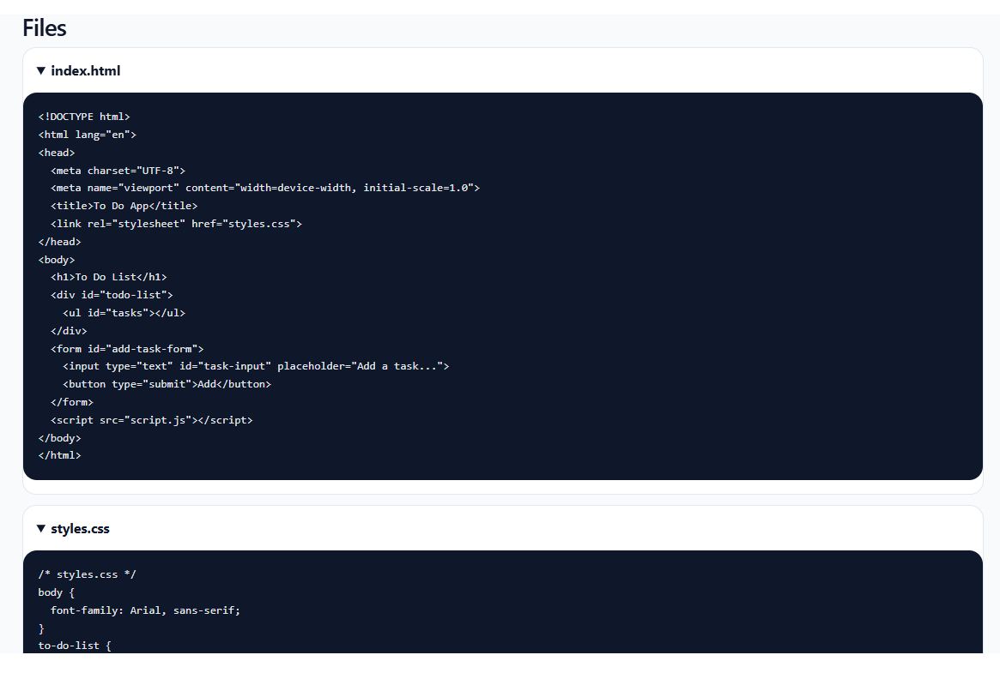

# Multi-Agent Coding Assistant

## Description

Multi-Agent Coding Assistant est une plateforme IA de génération automatique de projets logiciels construite avec .NET 9, Blazor, EF Core, PostgreSQL et Ollama.

Le système fonctionne comme une petite équipe virtuelle composée de plusieurs agents IA capables de :

- comprendre une demande utilisateur en langage naturel
- planifier l’architecture d’un projet
- générer automatiquement les fichiers source
- organiser la structure du projet
- produire des logs temps réel
- relire et valider le code généré
- exporter un projet fonctionnel en ZIP

---

# Exemple

Prompt utilisateur :

Build a calculator web app with add, subtract, multiply and divide buttons

Le système génère automatiquement :

calculator-app/
├── index.html
├── style.css
└── script.js

avec une application fonctionnelle exportable en ZIP.

Fonctionnalités actuelles

Backend
.NET 9 Web API
Clean Architecture
EF Core + PostgreSQL
Repository + UnitOfWork
Orchestrateur multi-agent
Workflow asynchrone
Génération IA via Ollama
Export ZIP des projets générés
SignalR realtime notifications
Frontend
Blazor Web App
UI moderne responsive
Génération IA interactive
Logs temps réel
Visualisation des fichiers générés
Téléchargement ZIP
Workflow temps réel SignalR

## Architecture

MultiAgentCodingAssistant/
├── src/
│   ├── CodingAssistant.Api
│   ├── CodingAssistant.Domain
│   ├── CodingAssistant.Application
│   ├── CodingAssistant.Infrastructure
│   ├── CodingAssistant.Contracts
│   └── CodingAssistant.Web
│
├── tests/
│   └── CodingAssistant.Tests

## Workflow Multi-Agent

Le système simule plusieurs agents IA collaboratifs :

Agent	Responsabilité
Planner Agent	Analyse la demande utilisateur
Architect Agent	Définit l’architecture du projet
Developer Agent	Génère les fichiers source
Reviewer Agent	Vérifie et valide le résultat
System Agent	Gère orchestration et monitoring
Workflow Temps Réel
User Prompt
    ↓
Planner Agent
    ↓
Architect Agent
    ↓
Developer Agent
    ↓
Reviewer Agent
    ↓
ZIP Export

Les événements sont diffusés en temps réel via SignalR :

GenerationStarted
AgentMessage
FileGenerated
GenerationCompleted
GenerationFailed

## Stack Technique

### Backend
	.NET 9
	ASP.NET Core Web API
	Entity Framework Core
	PostgreSQL
	SignalR
	Swagger/OpenAPI
	
### Fontend
	Blazor
	CSS responsive moderne
	SignalR Client
	
### AI
	Ollama
	qwen2.5-coder
	OpenAI-ready architecture
	LangGraph-ready architecture
	Semantic Kernel ready
	
## Screenshots

Home

Generation UI

Generation UI

Generated Files

ZIP Export

## Roadmap

Phase 1 — MVP
 Clean Architecture
 EF Core + PostgreSQL
 API génération
 Multi-agent orchestration
 Génération HTML/CSS/JS
 Export ZIP
 UI Blazor
 Workflow asynchrone
 SignalR realtime
 Ollama integration
 
Phase 2
 Background queue workers
 Multi-template generation
 React/Vue/.NET templates
 Dockerfile generation
 AI architecture planner
 AI code reviewer
 Persistent execution history

Phase 3
 OpenAI support
 Multi-model routing
 AI test generation
 CI/CD generation
 GitHub export
 Workspace generation

Phase 4
 Autonomous coding workflows
 Multi-file reasoning
 AI debugging agent
 DevOps agent
 Full agent collaboration system

## Vision

Construire une plateforme IA capable de transformer une idée exprimée en langage naturel en projet logiciel fonctionnel automatiquement grâce à des workflows multi-agents temps réel.

## Autheur
Rachid Bariz